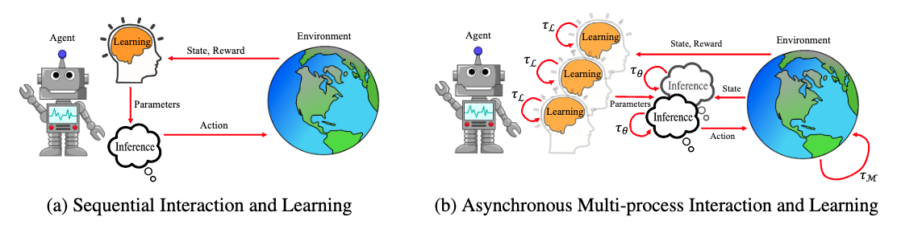
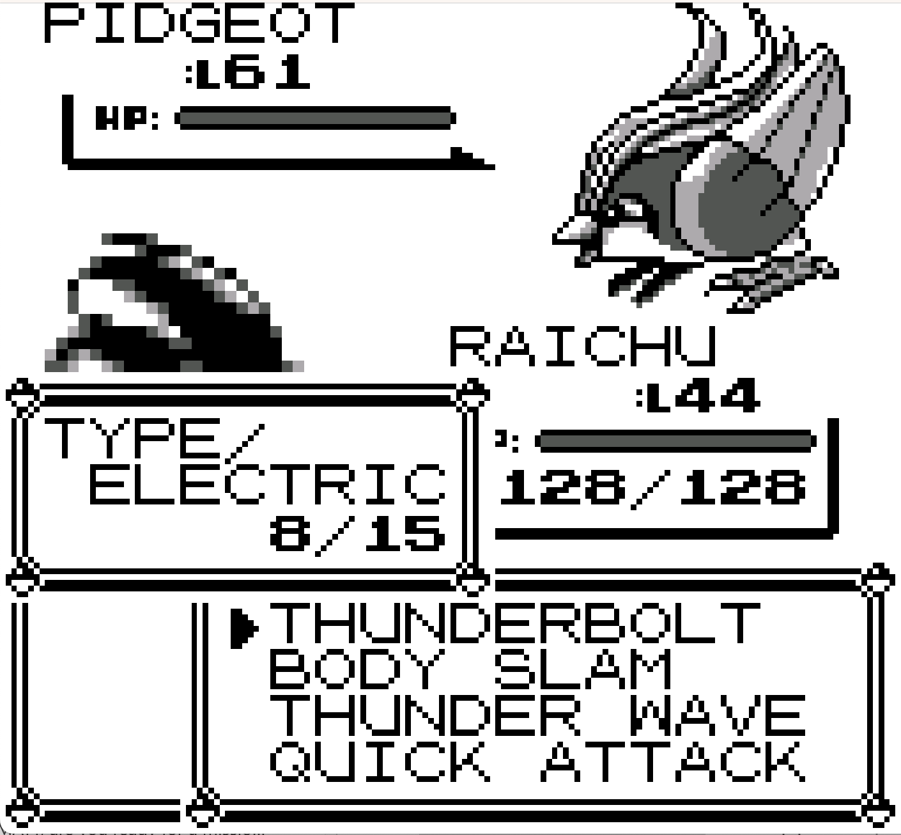
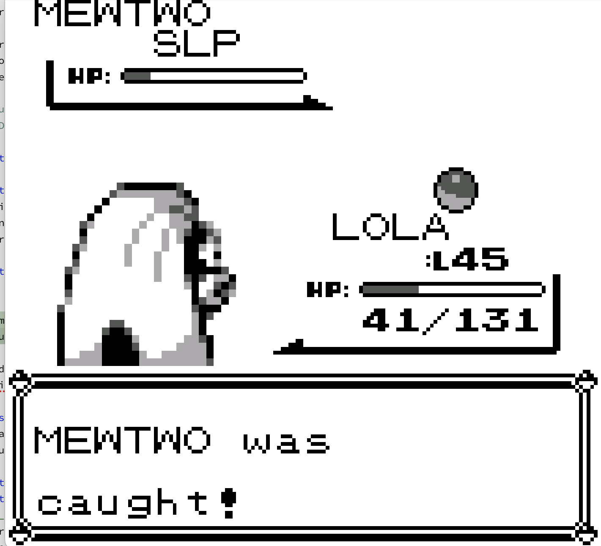
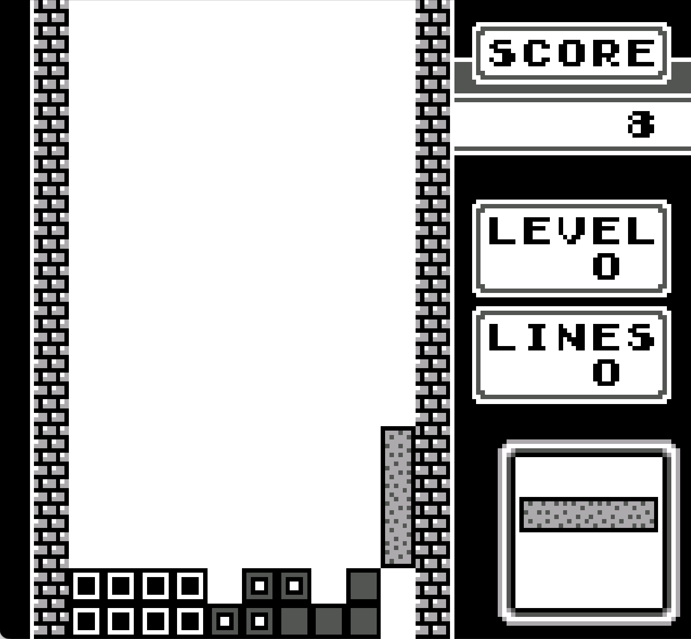

# Realtime RL
Code for Enabling Realtime Reinforcement Learning at Scale with Staggered Asynchronous Inference
- 📄 [Enabling Realtime Reinforcement Learning at Scale with Staggered Asynchronous Inference](https://openreview.net/pdf?id=fXb9BbuyAD)



[//]: # (![Build Status]&#40;https://img.shields.io/github/actions/workflow/status/username/repo/build.yml&#41;)

[//]: # (![License]&#40;https://img.shields.io/github/license/username/repo&#41;)

[//]: # (![Version]&#40;https://img.shields.io/github/v/release/username/repo&#41;)

## Description
This is the code for the paper, titled "Enabling Realtime Reinforcement Learning at Scale with Staggered Asynchronous Inference". The paper discusses the challenges and potential solutions for deploying large neural network models in real-time reinforcement learning (RL) environments. Traditional RL frameworks use a sequential interaction model, where actions and learning must occur in sequence, limiting the ability to react quickly in dynamic environments. This is particularly problematic as neural networks grow in size, increasing inference times, which restricts the frequency of actions in real-time settings.

We use the Pokemon Gameboy Environment and Tetris for the experiments in this repository.

  


The code is fully written in Python using Pytorch as the Deep Learning Framework.
## Table of Contents
- [Installation](#installation)
- [Usage](#usage)
- [License](#license)


## Installation

### Prerequisites
- Python 3.7.3
- pip (Python package manager)
- conda/mini-conda

### Steps

1. Clone the repository from github using git clone or by downloading the zip folder of the code.

2. Navigate into the project directory:
    ```bash
   cd realtime_rl

3. Create your environment and activate it
    ```bash
   conda env create -f environment.yml
   conda activate async_rl

## Usage: Pokemon Experiments
Certain Modules need to be installed/loaded in your conda envrironment for running the code such as gcc, opencv etc. You must also follow the directions below in the "Game Boy Environment Setup" section. Then 
just activate your conda environment before running the code (example shown below):
   
   ```bash
PYTHONUNBUFFERED=1 OMP_NUM_THREADS=1 MKL_NUM_THREADS=1 python run_realtime_pokemon.py --k 7 --game "blue" --setting "battles" --num_inf 12  --num_learn 3 --t_theta_max 0.1 --seed 0
```
#### where 
`k`: This variable controls the size of the model used.

- **Possible values**:
  - 1: 1M Parameter Model
  - 7: 10M Parameter Model
  - 29: 100M Parameter Model
  - 98: 1B Parameter Model

`game`: This variable is used for choosing the game in our environment.

- **Possible values**:
  - `blue`: Pokemon Blue
  - `red`: Pokemon Red
  - `yellow`: Pokemon Yellow

`setting`: Used to specify the setting in the pokemon game.

- **Possible values**:
  - `battles`: Pokemon Battles Setting.
  - `catching`: Pokemon Catching setting.

 `num_inf`: Refers to the number of Inference processes.

 `num_learn`: Refers to the number of Learning processes.

 `t_theta_max`: Refer to the t_theta value that needs to be set for the max algorithm [Alg 1 in Paper]
   (refer to the paper for some intuition).

`seed`: Refers to the random seed value.

`run_pokemon_experiments.sh` shows all the commands we use for the different experiments (citing figures) shown in the paper.

## Usage: Tetris Experiments

We have zipped the Tetris demonstration data for efficient storage, so you must first unzip `tetris_episode0.zip` to run these experiments. You must also follow the directions below in the "Game Boy Environment Setup" section. Then just activate your conda environment before running the code (example shown below):

```bash
python3 simulate_delay_tetris.py --model "dqn" --cuda yes --delay 8 --noops 8 --seed 0
```
#### where 
`model`: This variable controls the learning algorithm used i.e. either `dqn`, `random`, or `noop`.

`delay`: This variable controls action delay corresponding to a particular model size.

- **Possible values**:
  - 1: 55K Parameter Model
  - 5: 1M Parameter Model
  - 8: 10M Parameter Model
  - 70: 100M Parameter Model
  - 596: 1B Parameter Model

`noops`: This variable controls the number of noops per action corresponding to a particular model size.
 
- **Possible values**:
  - 0: Asynchronous Interaction
  - 1: Sequential Interaction 55K Parameter Model
  - 5: Sequential Interaction 1M Parameter Model
  - 8: Sequential Interaction 10M Parameter Model
  - 70: Sequential Interaction 100M Parameter Model
  - 596: Sequential Interaction 1B Parameter Model

 `cuda`: Set to `yes` to run on GPU and `no` to run on CPU.

 `pretrain_steps`: The number of steps of training on the one episode of human demonstration data.

 `explore`: The number of steps of training used for the exploration schedule until reaching the minimum exploration rate.

`seed`: Refers to the random seed value.

`run_tetris_experiments.sh`shows all the commands we use for the different experiments in Figure 5 of the paper.

## Usage: Atari Experiments

activate your conda environment before running the code (example shown below):

```bash
python3 simulate_delay_atari.py --game "BoxingNoFrameSkip-v4" --num_actions 18 --model "dqn" --cuda yes --delay 8 --noops 8 --seed 0
```
#### where 
`game`: We use the NoFrameSkip-v4 environments to enable a frame by frame realtime simulation i.e. `BoxingNoFrameSkip-v4`, `KrullNoFrameSkip-v4`, and `NameThisGameNoFrameSkip-v4`.

`num_actions`: The number of actions in the game `6` for Name This Game and `18` for Boxing and Krull.

`model`: This variable controls the learning algorithm used i.e. either `dqn`, `rainbow`, `random`, or `noop`.

`delay`: This variable controls action delay corresponding to a particular model size.

- **Possible values**:
  - 1: 55K Parameter 1xDeep Model
  - 3: 70K Parameter 2xDeep Model
  - 5: 1M Parameter 1xDeep Model
  - 8: 10M Parameter 1xDeep Model
  - 29: 1M Parameter 2xDeep Model
  - 47: 10M Parameter 2xDeep Model
  - 70: 100M Parameter 1xDeep Model
  - 80: 100M Parameter 2xDeep Model
  - 599: 1B Parameter 1xDeep Model (Atari is a little bit faster than the Game Boy)
  - 750: 1B Parameter 2xDeep Model


`noops`: This variable controls the number of noops per action corresponding to a particular model size.
 
- **Possible values**:
  - 0: Asynchronous Interaction
  - 1: Sequential Interaction 55K Parameter 1xDeep Model
  - 3: Sequential Interaction 70K Parameter 2xDeep Model
  - 5: Sequential Interaction 1M Parameter 1xDeep Model
  - 8: Sequential Interaction 10M Parameter 1xDeep Model
  - 29: Sequential Interaction 1M Parameter 2xDeep Model
  - 47: Sequential Interaction 10M Parameter 2xDeep Model
  - 70: Sequential Interaction 100M Parameter 1xDeep Model
  - 80: Sequential Interaction 100M Parameter 2xDeep Model
  - 599: Sequential Interaction 1B Parameter 1xDeep Model (Atari is a little bit faster than the Game Boy)
  - 750: Sequential Interaction 1B Parameter 2xDeep Model

 `cuda`: Set to `yes` to run on GPU and `no` to run on CPU.


`seed`: Refers to the random seed value.

`run_atari_experiments.sh`shows all the commands we use for the different experiments in Figure 6 of the paper.

## License

This project is licensed under the MIT License. See the LICENSE file for details.


## Game Boy Environment Setup
Each game integration has files listing memory locations for in-game variables, reward functions based on those variables, episode end conditions, savestates at the beginning of levels and a file containing hashes of ROMs that work with these files. 
We provide the savestates for each of the environment settings we tested our approach on.
The folder `custom_integrations` has the save states of the different game settings that are available for our experiments.

Please note that Game Boy ROM files are copyrighted material that are not included in this repository. You must obtain them yourself to train on these environments. In each subfolder of the `custom_integrations` directory, there is a file called `rom.sha` that is generated using `shasum -a 256`. The file includes a checksum for the correct file and a correct file name that must be added to this directory for each setting we consider for our experiments on the Game Boy.

   
